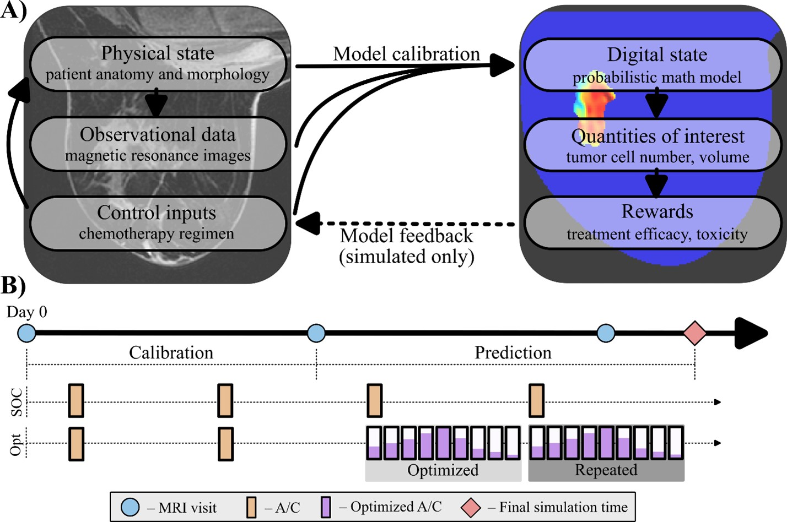

# TNBC_DigitalTwins

## Code for: Personalizing neoadjuvant chemotherapy regimens for triple-negative breast cancer using a biology-based digital twin

### Reference: Christenson, C., Wu, C., Hormuth, D.A. et al. Personalizing neoadjuvant chemotherapy regimens for triple-negative breast cancer using a biology-based digital twin. npj Syst Biol Appl 11, 53 (2025). https://doi.org/10.1038/s41540-025-00531-z

### Examples:
The notebook in the examples folder, "DigitalTwin_example", provides a step by step walk through for loading "MRI" images (virtual data) and constructing the digital twin framework. The overarching mathematical model is described below:

$$
\begin{align*}
\frac{dN(x,t)}{dt} &= \nabla \cdot \left(D \nabla N(x,t) \right) k(x)N(x,t)\left(1-N(x,t)\right)-N(x,t)\sum_j \gamma_j(x,t) \\
\gamma_j(x,t) &= \alpha \sum_{k=1}^{T_j} AUC_{k}(x) \, C_{j,k} \, H\left(C_{j,k} - 0.1\right) e^{\beta_j\left(t-\tau_{j,k} \right)H\left(t-\tau_{j,k} \right)} 
\end{align*}
$$

The data provided is a representative example of the processed diffusion-weighted MRI and dynamic contrast enhanced MRI required for the framework. This data is provided as 3D matrices and cropped to a 2D grid to speed up the demo.

The patient data is used a build a ROM representing the above mathematical model based on proper orthogonal decomposition. (See more details on the ROM at https://github.com/cchristenson2/PODforTumors)

The reduced mathematical model is fit to the loaded example data using an approximate Bayesian computation, implemented with pyABC. This code samples from a parameter distribution parameter provided as the prior to satisfy the following equation:

$$
\rho \left( \hat{N}_r(t), N_r(\theta,t)\right) \leq \epsilon
$$

where $\hat{N}_r$ and $N_r$ represent the measured and simulated cell numbers in reduced form. Epsilon is a tolerance for sampling acceptance determined based on a least squares estimation of theta. This provides an estimate of the best fit for which we want new parameters samples to match.

The calibrated model is then shown to make predictions of future imaging time points not included in the calibration. This concludes the construction of the digital state for the twin.

Once calibrated, two example optimization problems are shown to inform future therapy for the virtual patient. These two problems focus on either minimization of cell numbers using the same total dose or minimization of the total dose assuming the same response.

